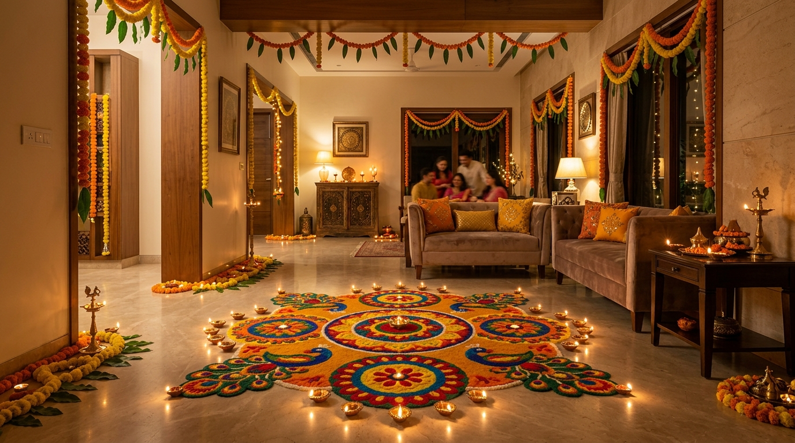

# Rupali's Arts — Handcrafted Festive Home Decor

> Modern, vibrant, and SEO-optimized website for **Rupali's Arts** (`@rupalis_arts`), celebrating handcrafted woolen rangolis, sunflower Ganpati aasans, and embellished pearl diya holders.



---

## 🌟 Features

- **Artisanal Festive Aesthetic**: Royal Emerald Green, Marigold Golden Yellow, and Auspicious Crimson palette with subtle particle effects.
- **Direct Instagram DM Checkout**: Every product features instant redirection to `@rupalis_arts` on Instagram DM for pricing and custom orders.
- **Interactive "Decorate My Space" Studio**: Drag & drop virtual floor visualizer with Day / Diwali Candlelight glow lighting mode.
- **Multi-Device Responsive**: Flawless experience across Mobile, Tablet, iPad, Laptop, and 4K Desktop.
- **Comprehensive SEO**:
  - `JSON-LD` schemas (`Store`, `ItemList`, `Product`, `FAQPage`, `BreadcrumbList`).
  - OpenGraph & Twitter Card social meta tags.
  - Built-in `sitemap.xml` and `robots.txt`.
- **Interactive FAQ Accordion**: Customer questions regarding washing, reusability, durability, and custom orders.
- **Ambient Audio Synthesizer**: Gentle sitar/temple chime tones using Web Audio API.

---

## 🌸 Product Catalog

1. **Sunflower Velvet Aasan for Ganpati Bappa** (Saffron Orange & Green / Royal Purple & White with pearl drops)
2. **Handmade Pearl & Kundan Diya Holders** (Singles & Pairs with wax/LED tealight candle base)
3. **Woolen Floral Mandala Rangoli** (8-petal tufted wool blooming mandala in orange and yellow)
4. **Woolen Pathway & Border Rangoli Mats** (Sunflower stepping flowers with center tealight holder)
5. **Detachable 2-Piece Paisley Rangoli Arch** (Door threshold framing set with tassel charms)
6. **Detachable 2-Piece Semicircle Royal Mandala** (Split emerald green and golden yellow half-moons)

---

## 🚀 Getting Started

Simply open `index.html` in any modern web browser or serve locally:

```bash
# Python
python -m http.server 8080

# Or Node.js
npx serve .
```

---

## 📸 Connect with Rupali's Arts

- **Instagram**: [@rupalis_arts](https://www.instagram.com/rupalis_arts/)
- **Direct Message**: [ig.me/m/rupalis_arts](https://ig.me/m/rupalis_arts)
- **WhatsApp**: [+91 8552939652](https://wa.me/918552939652)

---

© 2026 Rupali's Arts. All Rights Reserved. Handmade with ❤️
